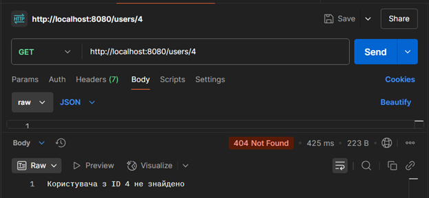
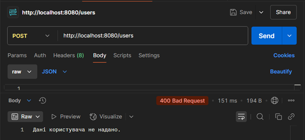
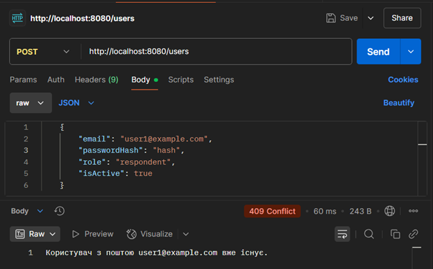
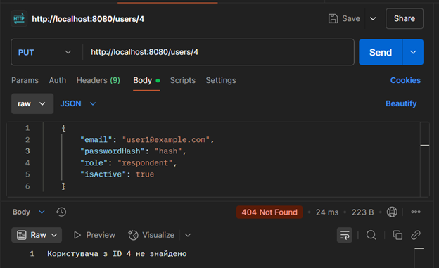
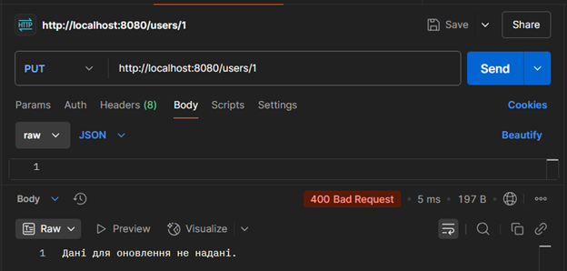
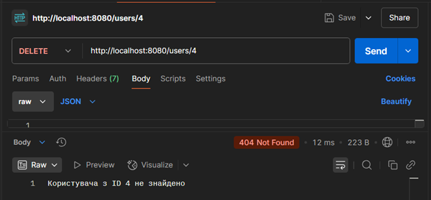

# Тестування працездатності системи

Тестування проводилося за допомогою Postman.

## Отримання всіх користувачів

## Отримання користувача по id

## Створення користувача

Вміст таблиці 'User' з створеним юзером

## Оновлення користувача

Вміст таблиці 'User' після редагування юзера

## Видалення користувача

Вміст таблиці 'User' після видалення юзера

# Тестування обробки винятків

## Перевірка отримання користувача

Користувач для отримання не знайдений

## Перевірка створення користувача

Відсутні дані

Користувач з такою поштою вже існує

## Перевірка оновлення користувача

Користувач для оновлення не знайдений

Відсутні дані для оновлення

## Перевірка видалення користувача

Користувач з таким ID не знайдений

