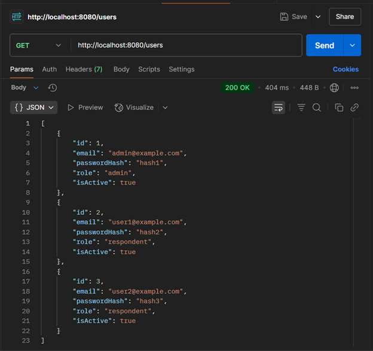
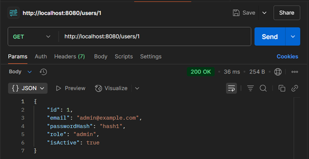
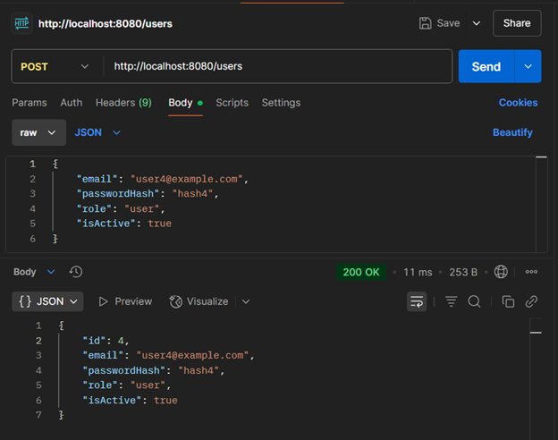
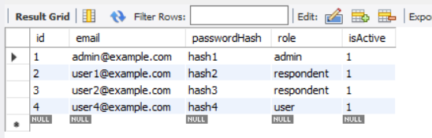
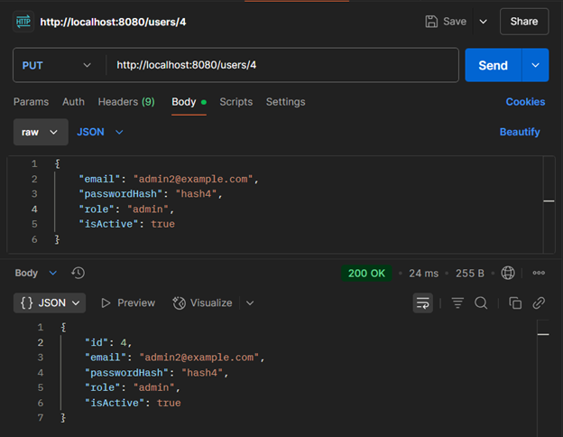
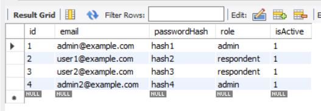
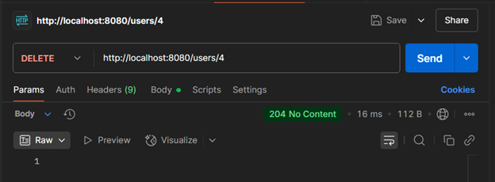
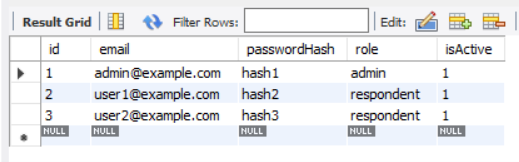

# Тестування працездатності системи

Тестування проводилося за допомогою Postman.

## Отримання всіх користувачів

## Отримання користувача по id

## Створення користувача

### Вміст таблиці 'User' з створеним юзером

## Оновлення користувача

### Вміст таблиці 'User' після редагування юзера

## Видалення користувача

### Вміст таблиці 'User' після видалення юзера

